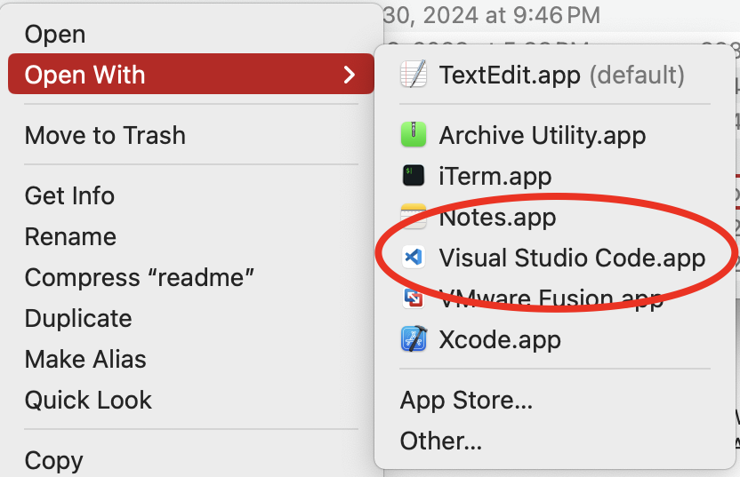

# Make VS Code a Finder option for any text file

This script is designed to facilitate the modification of the `Info.plist` file located in `/Applications/Visual Studio Code.app/Contents/`. 

The purpose of the modification is to enable Visual Studio Code (VS Code) to appear as an option under "Open With" for any text file types in Finder.



## Usage

```
sudo python3 modify-info-plist.py
```

Follow the on-screen instructions to paste the modified `Info.plist` content.

## How It Works

1. **Generate Modified Info.plist**: The script generates a copy of `Info.plist` file which is modified with a few lines to cause the system to treat VS Code as able to open any text file.
2. **Open VS Code Editors**: The script opens two instances of VS Code. One for viewing the original `Info.plist` and the other for pasting the modified version.
3. **Modification**: You need to manually paste the modified `Info.plist` content which includes configurations to handle various text file types.
4. **Launch Services Update**: After saving the changes to `Info.plist`, press ENTER and the script executes a launch services update command.

## Modification to `Info.plist`

This is the block inserted into `Info.plist` to make VS Code appear as an "Alternate" editor for text files in Finder.

```xml
<dict>
    <key>CFBundleTypeExtensions</key>
    <array>
        <string>*</string>  <!-- Wildcard for all files -->
    </array>
    <key>CFBundleTypeName</key>
    <string>Public Text File</string>
    <key>CFBundleTypeRole</key>
    <string>Editor</string>
    <key>LSItemContentTypes</key>
    <array>
        <string>public.text</string>
        <string>public.plain-text</string>
        <string>public.script</string>
        <string>public.source-code</string>
        <string>public.data</string>
    </array>
    <key>LSHandlerRank</key>
    <string>Alternate</string>
</dict>
```
